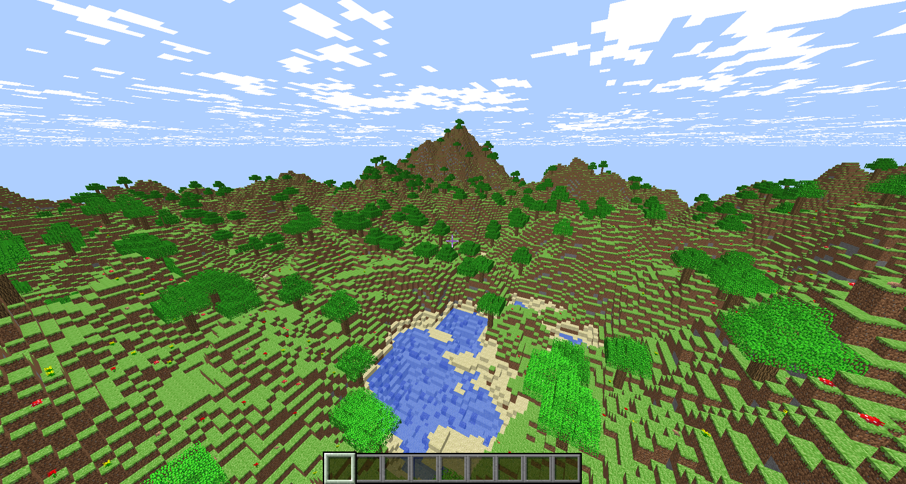

# MinecraftClone
Barebones multi-threaded C++17 OpenGL Minecraft clone. Only implements terrain generation, collisions and block breaking / placing; no mobs, crafting, biomes, weather, multiplayer, saves, etc. Created purely for practicing concurrency.

